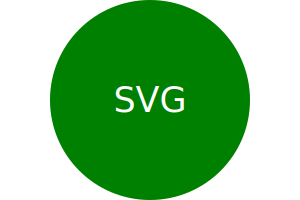

# OOP-SVGLogo-Maker

## Description

This is my SVG Logo maker! This logo maker should solve the following user story:

In this project, I learned how to use jest to write tests to ensure my code is working as expected. The example test provided in canvas made a lot easier to write the tests(I copied and pasted the code three times for each shape and modified the parameters to match the ones I set in my shape.js file). I was using inquirer 10 so it was throwing so many errors in the beginning. Shoutout to my bootcamp teacher Robbert Wijtman for reminding me to check that and use inquirer 8.2.4 - I had to run npm install@8.2.4 at the root of the project to get the correct version installed. I also had to rely heavily on the xpert ai tool for assistance on sections I got stuck at. I had trouble figuring out the right parameters for each shape so I used the ai tool for assistance with the attributes to create a circle, triangle, square and for centering the text.
 
 Overall, I had fun with creating the tests and getting the svg logo maker to work! I can't wait to use it for a future project XD.

## User Story
AS a freelance web developer
I WANT to generate a simple logo for my projects
SO THAT I don't have to pay a graphic designer

## Acceptance Criteria
GIVEN a command-line application that accepts user input
WHEN I am prompted for text
THEN I can enter up to three characters
WHEN I am prompted for the text color
THEN I can enter a color keyword (OR a hexadecimal number)
WHEN I am prompted for a shape
THEN I am presented with a list of shapes to choose from: circle, triangle, and square
WHEN I am prompted for the shape's color
THEN I can enter a color keyword (OR a hexadecimal number)
WHEN I have entered input for all the prompts
THEN an SVG file is created named `logo.svg`
AND the output text "Generated logo.svg" is printed in the command line
WHEN I open the `logo.svg` file in a browser
THEN I am shown a 300x200 pixel image that matches the criteria I entered

## Installation

1) clone the repo in a code editor.

2) right-click on index.js file and run these two commands:
    -npm install inquirer@8.2.4 jest 
    -node index.js.

3) answer the prompts until you get the success message.

4) open logo.svg file in browser

## Usage 

[Walk-through Video](https://drive.google.com/file/d/1qz6SXjsJ3fxrqNSjNY1Q94mFl6m8cnH_/view?usp=sharing)

## Credits

Used bootcamp class drills and re-watched class cloud recordings.

Reached out to my teacher for assistance - Robbert Wijtman.

Used the Xpert AI tool for assistance with the svg attributes/questions about how to approach/create certain functions (Searched how to create an svg triangle that fills 300x200 pixels - copied attributes and pasted in code for circle, square and triangle, etc.)

Used documentation provided in canvsas:
https://developer.mozilla.org/en-US/docs/Web/SVG/Tutorial/Texts
https://developer.mozilla.org/en-US/docs/Web/SVG/Tutorial/Basic_Shapes
https://developer.mozilla.org/en-US/docs/Web/SVG/Tutorial

Tried using constructor so I can get more familiar with using it > decided to write code without it since I can initialize directly in the class body.

## Questions
If you had any questions, please feel free to contact me at lovelytau650@gmail.com.
Here is my GitHub profile link https://github.com/Love4Tau
